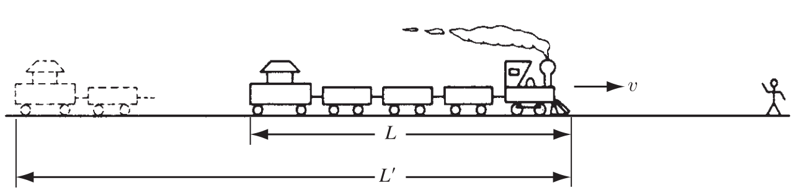

## **Liénard–Wiechert Potentials**

My next project is to calculate the **(retarded) potentials**, $V(\mathbf{r}, t)$ and $\mathbf{A}(\mathbf{r}, t)$, of a point charge $q$ that is moving on a specified trajectory

$$
\mathbf{w}(t) \equiv \text{position of } q \text{at time} t
\tag{10.39}
$$

The retarded time is determined implicitly by the equation

$$
|\mathbf{r} - \mathbf{w}(t_r)| = c (t - t_r)
$$

for the left-hand side represents the distance the “news” (disturbance) must travel, and $(t - t_r)$ is the time it takes to make the trip.

I shall call $\mathbf{w}(t_r)$ the **retarded position** of the charge, and

$$
\mathbf{r} - \mathbf{r}' = \mathbf{r} - \mathbf{w}(t_r)
$$

the vector from the retarded position to the field point $\mathbf{r}$.

It is important to note that **at most one point** on the trajectory is “in communication” with $\mathbf{r}$ at any particular time $t$ .

For suppose there were two such points, with retarded times $t_1$ and $t_2$ :

$$
\mathbf{r} - \mathbf{r}'_1 = c (t - t_1) 
$$

$$
\mathbf{r} - \mathbf{r}'_2 = c (t - t_2) 
$$

then

$$
\mathbf{r}'_2 - \mathbf{r}'_1 = c (t_2 - t_1)
$$

so the average velocity of the particle in the direction of $\mathbf{r}$ would have to be c—and that’s not counting whatever velocity the charge might have in other directions.

Since no charged particle can travel at the speed of light, it follows that only **one retarded point contributes to the potentials at any given moment**.

>For the same reason, an observer at ( \mathbf{r} ) sees the particle in only one place at a time. By contrast, it *is* possible to hear an object in two places at once. Consider a bear that growls at you, then runs toward you at the speed of sound, and growls again;you will hear both growls at the same time, coming from two different locations—but of course, there is still only one bear.

A naïve reading of the formula (Eq. 10.26)

$$
V(\mathbf{r}, t) = \frac{1}{4\pi \varepsilon_0} \int \frac{\rho(\mathbf{r}', t_r)}{|\mathbf{r}-\mathbf{r}'|} d\tau'
\tag{10.40}
$$

might suggest that the potential is simply

$$
V = \frac{1}{4\pi \varepsilon_0} \frac{q}{|\mathbf{r}-\mathbf{r}'|}
$$

(the same as in the static case, with the understanding that $|\mathbf{r}-\mathbf{r}'|$ is the distance to the **retarded position** of the charge).

But **this is wrong**, for a very subtle reason.

It is true that for a point source, the denominator $|\mathbf{r}-\mathbf{r}'|$ comes outside the integral, but what remains,
$$
\int \rho(\mathbf{r}', t_r)d\tau'
\tag{10.41}
$$
is **not equal to the charge of the particle**—and, through $t_r$, depends on the location of the observation point $\mathbf{r}$.

>There is, however, an implicit change in its functional dependence: Before the integration, $|\mathbf{r} - \mathbf{r}'|$ is a function of both $\mathbf{r}$ and $\mathbf{r}'$; after the integration, which fixes $\mathbf{r}' = \mathbf{w}(t_r)$ , $|\mathbf{r} - \mathbf{r}'| = |\mathbf{r} - \mathbf{w}(t_r)|$ is (like $t_r$ ) a function of $\mathbf{r}$ and $t$ .

To calculate the total charge of a configuration, you must integrate $\rho$ over the entire distribution at **one instant of time**, but here the retardation

$$
t_r = t - \frac{|\mathbf{r}-\mathbf{r}'|}{c}
$$

obliges us to evaluate $\rho$ at **different times** for different parts of the configuration.

If the source is moving, this gives a **distorted picture** of the total charge.

You might think this problem would disappear for point charges, but it doesn’t.

In Maxwell’s electrodynamics, formulated in terms of charge and current densities, a point charge must be regarded as the **limit of an extended charge**, as its size goes to zero.

And for such an extended particle—no matter how small—the retardation in Eq. (10.41) introduces a factor

$$
\left[ 1 - \frac{\mathbf{r}-\mathbf{r}'}{|\mathbf{r}-\mathbf{r}'|} \cdot \frac{\mathbf{v}}{c} \right]^{-1}
$$

where $\mathbf{v}$ is the velocity of the charge at the **retarded time**.

Thus,

$$
\int \rho(\mathbf{r}', t_r) d\tau' = \frac{q}{1 - \frac{\mathbf{r}-\mathbf{r}'}{|\mathbf{r}-\mathbf{r}'|} \cdot \frac{\mathbf{v}}{c}}
\tag{10.42}
$$

### Proof

This is a purely geometrical effect.

It may help to tell the story in a less abstract context.

You may not have noticed it, but a train **coming toward you** looks a little **longer** than it really is.

That’s because the light you receive from the caboose left **earlier** than the light you receive simultaneously from the engine, and at that earlier time the train was **farther away** (see Fig. 10.6).

In the interval it takes light from the caboose to travel the extra distance $L'$, the train itself moves a distance $L' - L$ :

$$
\frac{L'}{c} = \frac{L' - L}{v}
$$

or

$$
L' = \frac{L}{1 - v/c}
$$

So approaching trains appear longer, by a factor

$$
\frac{1}{1 - v/c}
$$

By contrast, a train going away from you looks shorter, by a factor

$$
\frac{1}{1 + v/c}
$$

>Please note that this has nothing whatever to do with special relativity or Lorentz contraction. $L$ is the length of the moving train, and its rest length is not at issue. The argument is somewhat reminiscent of the Doppler effect.

In general, if the train’s velocity makes an angle $\theta$ with your line of sight, the extra distance light from the caboose must cover is $L' \cos\theta$  (Fig. 10.7).

> I assume the train is far enough away or (more to the point) short enough so that rays from the caboose and engine can be considered parallel.

In the time $L' \cos\theta / c$ , the train moves a distance ( $L' - L$ ):

$$
\frac{L' \cos\theta}{c} = \frac{L' - L}{v}
$$

or

$$
L' = \frac{L}{1 - v\cos\theta/c}
$$

Notice that this effect does not distort dimensions perpendicular to the motion (the height and width of the train).

Never mind that the light from the far side is delayed in reaching you (relative to light from the near side)—since there’s no motion in that direction, they’ll still look the same distance apart.

The apparent volume $\tau'$ of the train is related to the actual volume $\tau$ by

$$
\tau' = \frac{\tau}{1 - \frac{\mathbf{r}-\mathbf{r}'}{|\mathbf{r}-\mathbf{r}'|} \cdot \frac{\mathbf{v}}{c}}
\tag{10.43}
$$

where $\frac{\mathbf{r}-\mathbf{r}'}{|\mathbf{r}-\mathbf{r}'|}$ is a unit vector from the train to the observer.

---

李納-維謝爾勢的推導與理解

起點是那個描述時變電荷分佈的延遲勢公式。

現在，把它應用到一個最簡單的、也是最重要的特例：一個沿著給定軌跡 $\mathbf{w}(t)$ 運動的點電荷 q。

這不很簡單嗎？

點電荷的「點」屬性，應該能讓積分裡的 $\rho d\tau'$ 直接變成 $q$，而分母上的 $\mathbf{r} - \mathbf{r}'$ 就是到電荷在延遲時刻 $t_r$ 的位置的距離 $R$。

所以電位似乎應該是：

$$
V(\mathbf{r}, t) \overset{?}{=} \frac{1}{4\pi \varepsilon_0} \frac{q}{R}
$$

這就是靜電場裡的庫侖勢，只不過把「當場」的位置換成了「延後」的位置。

聽起來非常合理。但這是錯的...這很難理解。

畢竟，一個點電荷，它的電量是 q，這是它的固有屬性，積分之後還會變成別的嗎？

事實是，在這個推遲勢的框架下，它真的會改變。

或許，這正揭示了「點電荷」本身是一個理想化的模型，不存在於真實世界，也不能指望它在我們所有的直覺下都表現正常了。

問題的根源在於那個延遲時間 $t_r = t - |\mathbf{r}-\mathbf{r}'|/c$。

積分 $\int \rho(\mathbf{r}', t_r) d\tau'$ 的意義，並不是計算某一時刻的總電荷。

它是在對一個非常詭異的物件積分：這個物件的不同部分，其電荷密度是在不同的歷史時刻被定義的。

為了理解一個運動的點電荷，我們必須先把它想像成一個具有很小但有限大小的電荷雲，最後再讓它的尺寸趨於零。

一旦考慮進這個「擴展」的圖像，問題就清晰了。

格里菲斯用一個絕妙的火車幾何類比繞開了複雜的計算。

這個類比的核心思想是：由於光速有限​​，我們看到的運動物體的圖像是扭曲的。

- 一列朝我開來的火車：我同時看到車頭和車尾的光。但車尾的光必須更早發出才能和車頭的光同時到達我的眼睛。在更早的那一刻，整個火車離我更遠，所以當時車尾和車頭之間的距離，在我「看來」比火車真實的長度 L 還要長。計算一下就會發現，看到的長度 $L' = L / (1 - v/c)$。

- 推廣到三維：對於一個移動的電荷雲，只有沿著運動方向（即我的視線方向）的尺寸會被拉長或壓縮，垂直於視線的尺寸不變。所以，「視體積 $\tau'$」 和 「真體積 $\tau$」 的關係是：

$$
\tau' = \frac{\tau}{1 - \mathbf{n} \cdot \mathbf{v}/c}
$$
這裡 $\mathbf{n}$ 是從電荷指向我的單位向量，$\mathbf{v}$ 是電荷在延遲時刻的速度。

現在，最關鍵的一步是理解積分 $\int \rho(\mathbf{r}', t_r) d\tau'$ 到底對應什麼。

電荷量 q 是守恆的，它等於在同一瞬間對真實體積的積分。

但我們這個積分，用的密度 $\rho$ 是推遲時刻的，而積分元 $d\tau'$ 在幾何上對應的恰恰是那個被扭曲了的「視體積元」。

邏輯鏈條是這樣的：
1. 真實情況：總電荷 $q$ 均勻分佈在一個小的真實體積 $\tau$ 中。
2. 在我看來：由於光傳播的延遲，這個電荷團似乎被「拍扁」或「拉長」了，佔據了一個不同的體積 $\tau'$。如果它朝我運動，$\tau' > \tau$。
3. 因此，我「看到」的電荷密度（視密度）變小了，因為同樣的電荷量被分攤到了更大的視體積裡。
4. 然而，我們在推遲勢積分中使用的，並不是“視密度”，而是真實的、在推遲時刻的電荷密度 $\rho$。
5. 這就導致了錯誤：我們用「真實密度」去乘以「視體積元」進行積分，得到的結果自然不等於真實電荷量 $q$。具體來說，對於朝我運動的電荷，真實密度 > 視密度，所以這個積分的結果會大於 $q$。

嚴格的數學告訴我們，這個積分的結果剛好是：

$$
\int \rho(\mathbf{r}', t_r) d\tau' = \frac{q}{1 - \mathbf{n} \cdot \mathbf{v}/c}
$$

這就是那個神奇的修正因子的來源。

它不是一個神秘的新物理，而是一個純粹的幾何效應、一個視覺上的「透視」畸變。

把這個修正因子放回延後勢的公式，一切就豁然開朗了。

• 標量勢：

$$
V(\mathbf{r}, t) = \frac{1}{4\pi \varepsilon_0} \int \frac{\rho(\mathbf{r}', t_r)}{|\mathbf{r}-\mathbf{r}'|} d\tau'
$$

$$
=\frac{1}{4\pi \varepsilon_0} \frac{1}{R} \int \rho(\mathbf{r}', t_r) d\tau'
$$

$$
=\frac{1}{4\pi \varepsilon_0} \frac{q}{R \left( 1 - \frac{\mathbf{n} \cdot \mathbf{v}}{c} \right)}
$$

• 向量勢（因為電流密度 $\mathbf{J} = \rho \mathbf{v}$，速度 $\mathbf{v}$ 可以提到積分外）：

$$
\mathbf{A}(\mathbf{r}, t) = \frac{\mu_0}{4\pi} \int \frac{\mathbf{J}(\mathbf{r}', t_r)}{|\mathbf{r}-\mathbf{r}'|
} d\tau'
$$

$$
=\frac{\mu_0}{4\pi} \frac{\mathbf{v}}{R} \int \rho(\mathbf{r}', t_r) d\tau'
$$

$$
=\frac{\mu_0}{4\pi} \frac{q \mathbf{v}}{R \left( 1 - \frac{\mathbf{n} \cdot \mathbf{v}}{c} \right)}
$$

這就是最終的 李納-維謝爾勢。

其中 $R = \mathbf{r} - \mathbf{w}(t_r)$，所有與電荷相關的量（位置 $\mathbf{w}$、速度 $\mathbf{v}$）都必須在延遲時刻 $t_r$ 取值。

總結這個理解過程： 最初的天真想法錯在忽略了延遲效應帶來的「觀測不同步性」。點電荷的理想化模型在這個涉及比較不同時空點資訊的場景中，展現出了反直覺的特性。

格里菲斯的火車類比精妙地揭示了這個特性的幾何本質——它不過是光速有限導致的一種“視覺畸變”，並用一個清晰的因子 $(1 - \mathbf{n} \cdot \mathbf{v}/c)^{-1}$ 將其量化。這個因子是理解運動電荷電磁場（特別是輻射場）的關鍵。

---

### 關於推遲時間 $t_r$

推遲時間 $t_r$ 是由一個隱含的方程所定義的，這看起來像是一個循環參考。

但這個「循環」在數學上是良定義的，並不會導致無限迴圈，而是定義了一個隱函數。

讓我逐步解釋為什麼這個問題在推導中能被處理，並得到最終的結果。

#### 推遲時間 $t_r$ 的隱含方程

對於一個點電荷，其軌跡為 $\mathbf{w}(t)$，推遲時間 $t_r$ 由以下方程定義：

$$
t_r = t - \frac{\mathbf{r} - \mathbf{w}(t_r)}{c}
$$

這裡：

$\mathbf{r}$  和 $t$ 是觀察者的位置和時間，是給定的獨立變量。

$t_r$ 是未知數，需要從這個方程中解出。

$\mathbf{w}(t_r)$ 是點電荷在推遲時間的位置，依賴於 $t_r$。

這個方程確實是「隱含的」，因為 $t_r $ 出現在等式的兩邊：左邊是 $t_r$，右邊的 $\mathbf{r} - \mathbf{w}(t_r)$ 也是 $t_r$ 的函數。

因此，對於每個 $(\mathbf{r}, t)$，我們需要求解這個方程來獲得對應的 $t_r$ 。

這在數學上是一個隱函數問題，通常需要數值方法求解，但理論上是良定義的，只要軌跡 $\mathbf{w}(t)$ 是光滑的。

#### 在推導中如何處理這個隱含關係？

在格里菲斯（Griffiths）的推導中，這個隱含關係並沒有被「避開」，而是被內建在最終的李納-維謝爾勢表達式中。

推導的關鍵步驟在於：

當我們計算推遲勢的積分時，對於點電荷，積分會簡化為在推遲位置 $\mathbf{r}' = \mathbf{w}(t_r)$ 處的計算。

但此時 $t_r$ 還不是明確的，而是由上述隱含方程定義。

推導過程通過幾何論證（如火車類比）直接得到了積分 $\int \rho(\mathbf{r}', t_r) d\tau'$ 的結果，即 $\frac{q}{1 - \mathbf{n} \cdot \mathbf{v}/c}$ ，其中 $\mathbf{n} = \frac{\mathbf{r} - \mathbf{w}(t_r)}{\mathbf{r} - \mathbf{w}(t_r)}$ 和 $\mathbf{v} = \dot{\mathbf{w}}(t_r)$。

重要的是：這個結果已經隱含地假設了 $t_r$ 是滿足推遲條件的。

也就是說，在最終的表達式中，所有與點電荷相關的量（位置 $\mathbf{w}(t_r)$、速度 $\mathbf{v}(t_r)$）都必須在推遲時間 $t_r$ 取值，而 $t_r$ 本身由隱含方程決定。

因此，推導並沒有直接「解決」這個循環，而是接受了這個隱含關係作為勢函數定義的一部分。

最終的李納-維謝爾勢：

$$
V(\mathbf{r}, t) = \frac{1}{4\pi \varepsilon_0} \frac{q}{\mathbf{r} - \mathbf{w}(t_r) \left( 1 - \frac{\mathbf{n} \cdot \mathbf{v}}{c} \right)}
$$

應該被理解為：對於每個 $(\mathbf{r}, t)$，必須先解出 $t_r$ 使得 $t_r = t - \mathbf{r} - \mathbf{w}(t_r)/c$，然後代入計算。

#### 為什麼這個隱含關係不會導致問題？

數學上：只要軌跡 $\mathbf{w}(t)$ 是合理的（例如連續可微），並且點電荷的速度低於光速，那麼對於每個 $(\mathbf{r}, t)$，推遲時間 $t_r$ 通常存在且唯一。這保證了勢函數是良定義的。

物理上：這個隱含關係反映了因果律：觀察者在時間 $t$ 測到的勢，是由點電荷在更早的時間 $t_r$ 的狀態所決定的，而 $t_r$ 取決於光從電荷傳播到觀察者的時間。這正是推遲勢的核心概念。

#### 在實際計算中如何處理？

在實際應用中，如果需要計算具體的勢或場，我們必須先求解隱含方程以獲得 $t_r$。例如：

如果點電荷是勻速運動，可能會有解析解。

一般情況下，可能需要數值方法（如牛頓迭代法）來解出 $t_r$。

但重要的是，李納-維謝爾勢給出了勢函數的封閉形式，其中 $t_r$ 是隱含確定的。

這在理論分析中非常有用，例如在推導電場和磁場時，我們可以直接對這個形式求導，而無需顯式解出 $t_r$（儘管求導過程會涉及鏈式法則和隱函數求導）。

總結

「無限迴圈」實際上是推遲勢的內在特性，它被處理的方式是通過隱函數的概念。

在推導中，這個關係沒有被消除，而是被融入最終表達式的定義中。

這並不影響結果的正確性，反而體現了電動力學中因果關係的深度。

李納-維謝爾勢的優點在於，它將這個複雜的依賴關係封裝在一個簡潔的公式中，便於進一步分析輻射場等現象。
